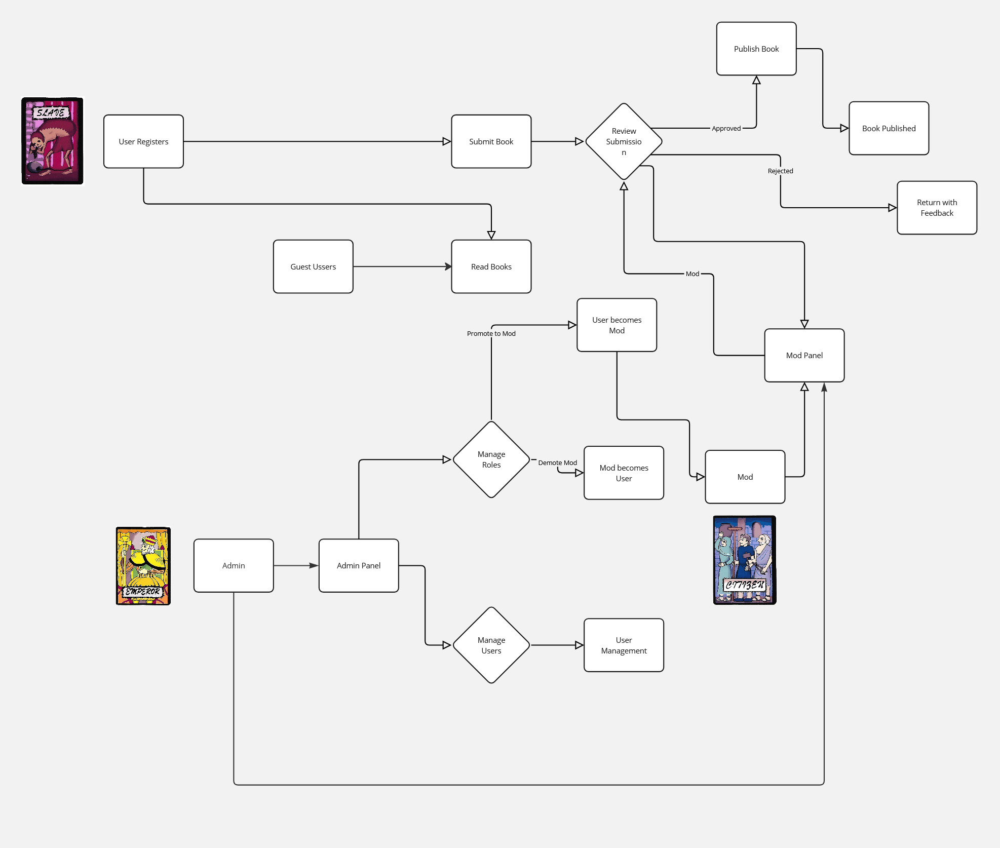

# 📖 Hussam Al-Hikma
This repository contains a flowchart representing the workflow of a book-related platform. The system includes user registration, book selection, reading, review submission, publishing, monetization, and user management functionalities.

## 🚀 Features

- **User Registration**: New users can sign up to access the platform.
- **Book Selection & Reading**: Users can browse and read books, as well as save them in their personal library.
- **User Roles**:
  - **King**: Can approve or reject shared books and comments. Kings can also assign users as Citizens or other Kings and define new user types and authors.
  - **Citizen**: Can share books and approve or reject content from other users.
  - **Slave**: Can share books and comment, but needs approval from a Citizen or King.
- **Review Submission**: Users can submit book reviews, which may be approved or rejected.
- **Publishing System**: Books can be submitted for review and published if accepted.
- **Monetization & Store**: Revenue management, event-based passes, and a store for purchasing content.
- **Admin Panel**: Admins or authors can manage users and content.

## 🛠️ Technologies Used

- Flowchart designed using a diagramming tool.
- The project is implemented using:
  - **Backend**: Laravel
  - **Frontend**: Next.js (TypeScript)
  - **Database**: SQLite

## 📂 Project Structure

```
📁 book-platform
│── 📜 README.md
│── 📁 backend   # Laravel backend implementation
│── 📁 frontend  # Next.js (TypeScript) frontend implementation
```

## 📸 Flowchart



## 📌 Getting Started

1. Clone the repository:
   ```bash
   git clone https://github.com/your-username/book-platform.git
   ```
2. Navigate to the project folder:
   ```bash
   cd book-platform
   ```
3. Install backend dependencies:
   ```bash
   cd backend
   composer install
   ```
4. Install frontend dependencies:
   ```bash
   cd ../frontend
   npm install
   ```
5. Run the backend:
   ```bash
   php artisan serve
   ```
6. Run the frontend:
   ```bash
   npm run dev
   ```

## 📜 License

This project is licensed under the MIT License - see the [LICENSE](LICENSE) file for details.

## 👥 Contributors

Feel free to contribute by submitting issues or pull requests!

---
**Happy Reading! 📚**

